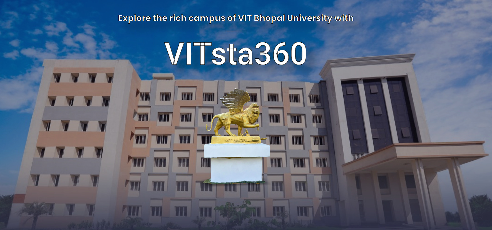

## Vitsta360 - Interactive 3D Map of VIT Bhopal

🔗 Project URL: https://vitsta360.techynar.com/

(Note: Image resolution may vary depending on your internet 🛜 speed.)

## 💡 What is Vitsta360?

Vitsta360 is an innovative web application designed to showcase a 3D map view of VIT Bhopal. It provides an engaging and user-friendly platform for campus navigation and exploration.

 

## ✨ Features

•	📌 3D Map Visualization: Offers an immersive view of the VIT Bhopal campus for better understanding.
•	🎨 User-Centric Design: Blends modern technology with an intuitive user interface.
•	📈 Demonstrates Expertise: Showcases skills in web development and visualization tools.
•	🌐 Accessibility: Fully responsive design for all devices.

## 🛠️ Technologies Used

•	Web Development: HTML, CSS, JavaScript
•	3D Visualization: [Tool/Software used, e.g., Blender, Three.js]

## 🌟 Why I Built This

I aimed to create a meaningful project that adds value to the VIT Bhopal community by enhancing campus navigation and highlighting the beauty of the campus through modern web technologies.

## 🙌 Acknowledgements

Heartfelt thanks to my mentors, peers, and everyone who supported me throughout this journey.

#3 📣 Looking Ahead

I'm excited to hear your feedback and ideas for improvement. Explore the platform and feel free to share your thoughts!

